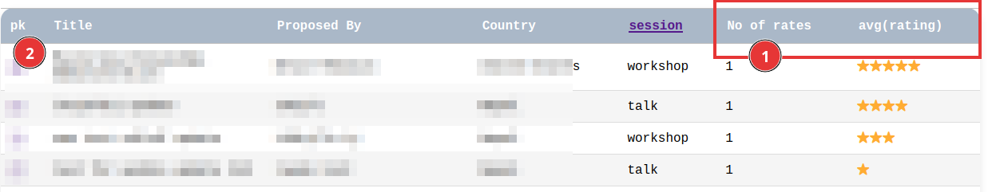
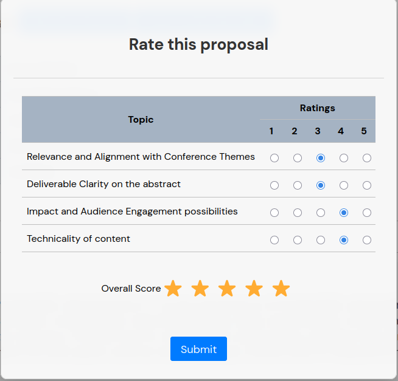

# Proposal evaluation
---

All the proposals submitted via system can be evaluated in  the system itself.

- Login are required for the evaluation
- `BASE_URL=http://pgconf.org.np`

## Evaluation baseline

The evaluation of the proposals are based on the following four points

1. Relevance and Alignment with Conference Themes
2. Deliverable Clarity on the abstract
3. Impact and Audience Engagement possibilities
4. Technicality of content

## Steps for evaluations
- Login to the system
- Navigate to the `Proposals > Evaluation Summary` through menu or directly
  navigate through `BASE_URL/proposals/evaluation/summary`

  This page contains list of the submitted proposals. Total number of rates
  and average rate value can be seen from here (marked (1) in Figure 1).

  

- The link in the first column (marked (2) in Figure 1) leads to the proposal detail page.
  From this page we can perform the rating.
  
  

  We can do following from this page (Figure 2)

  1. the submission details
  2. abstrat of the talk
  3. rate the propsal
  4. comment

- For providing the your rate click on the button (3) `Rate this Proposal`. This
  will open the dialog with input fields as shown in Figure 3.

  Along with rating, we can also score the proposal in overall
  (this is shown in the summary page as average - marked (1) in Figure 1).
  
  

  Once you are fine with the values, submit via  `Submit` button.

- Edit the rating following the same procedure.

- You can also comment the proposal (the comment will be compiled and sent to
  the presentor). Click `Add` button in the comment section (marked (4) in Figure 2) of proposal
  details form.
  
  This will lead us toward the comment input dialog. Provide the comment or
  justification of your rating. You can also insert the template for writeup.

- Once rated / commented, verify if your input are saved or not.

## Proposal evaluation report

Reviewer can see the detailed report of own/others review. To access this
navigate to the `Proposal > Evaluation Report` via menu or directly go to the
`$BASE_URL/proposals/evaluation/report`.

You can see all the proposals and their reviews.

